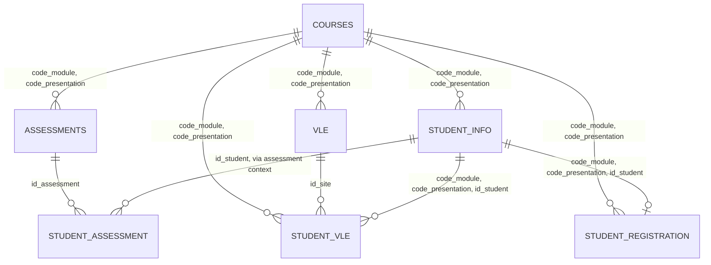

# OULAD - 7 bảng dữ liệu, ý nghĩa cột và quan hệ khóa

Tài liệu này mô tả chi tiết 7 bảng dữ liệu chính của **Open University Learning Analytics Dataset (OULAD)**:

- `courses`
- `assessments`
- `vle`
- `studentInfo`
- `studentRegistration`
- `studentAssessment`
- `studentVle`

Mục tiêu là giúp hiểu rõ từng bảng dùng để làm gì, mỗi cột có ý nghĩa gì, và các bảng liên kết với nhau bằng khóa chính - khóa ngoại như thế nào.

## 1. Lưu ý trước khi đọc schema

Các file CSV trong OULAD không khai báo khóa chính/khóa ngoại theo kiểu hệ quản trị cơ sở dữ liệu. Vì vậy, các khóa trong tài liệu này là **khóa logic** hoặc **khóa đề xuất** khi đưa dữ liệu vào database/data warehouse.

Trong thư mục `raw_data` của dự án này, bảng `studentVle` đang được tách thành 8 file:

- `studentVle_0.csv`
- `studentVle_1.csv`
- `studentVle_2.csv`
- `studentVle_3.csv`
- `studentVle_4.csv`
- `studentVle_5.csv`
- `studentVle_6.csv`
- `studentVle_7.csv`

Các file này có thêm một cột index không tên ở đầu file. Cột này là artifact do quá trình chia file, không phải cột nghiệp vụ chính thức của OULAD. Khi phân tích hoặc import vào database, nên bỏ cột này hoặc đổi tên thành cột kỹ thuật như `source_index`.

Các cột ngày như `date`, `date_registration`, `date_unregistration`, `date_submitted` đều là **ngày tương đối** so với ngày bắt đầu module-presentation. Ví dụ:

- `0`: ngày bắt đầu module-presentation.
- `-10`: 10 ngày trước ngày bắt đầu.
- `30`: 30 ngày sau ngày bắt đầu.

## 2. Tổng quan các bảng

| Bảng | Số dòng trong raw data | Grain - mỗi dòng đại diện cho | Khóa chính logic |
|---|---:|---|---|
| `courses` | 22 | Một module-presentation | (`code_module`, `code_presentation`) |
| `assessments` | 206 | Một bài đánh giá trong một module-presentation | `id_assessment` |
| `vle` | 6,364 | Một tài nguyên học tập trên VLE | `id_site` |
| `studentInfo` | 32,593 | Một sinh viên trong một module-presentation | (`code_module`, `code_presentation`, `id_student`) |
| `studentRegistration` | 32,593 | Thông tin đăng ký của một sinh viên trong một module-presentation | (`code_module`, `code_presentation`, `id_student`) |
| `studentAssessment` | 173,912 | Kết quả một bài đánh giá của một sinh viên | (`id_assessment`, `id_student`) |
| `studentVle` | 10,655,280 | Tương tác hằng ngày của một sinh viên với một tài nguyên VLE | (`code_module`, `code_presentation`, `id_student`, `id_site`, `date`) |

## 3. Sơ đồ quan hệ tổng quát



## 4. Bảng `courses`

### Ý nghĩa

`courses` là bảng danh mục các module-presentation có trong bộ dữ liệu. Một module có thể được mở nhiều lần ở các presentation khác nhau.

Ví dụ, `code_module = BBB` có thể xuất hiện ở nhiều presentation như `2013B`, `2013J`, `2014B`, `2014J`.

### Cột dữ liệu

| Cột | Ý nghĩa |
|---|---|
| `code_module` | Mã module đã được ẩn danh, ví dụ `AAA`, `BBB`, `CCC`. |
| `code_presentation` | Mã lần mở module, gồm năm và ký hiệu kỳ học, ví dụ `2013J`. |
| `module_presentation_length` | Độ dài module-presentation tính theo ngày. |

### Khóa

- **Khóa chính logic**: (`code_module`, `code_presentation`)

Mỗi dòng trong `courses` là một cặp module-presentation duy nhất.

## 5. Bảng `assessments`

### Ý nghĩa

`assessments` mô tả các bài đánh giá thuộc từng module-presentation. Bảng này cho biết mỗi bài đánh giá thuộc module nào, diễn ra ở presentation nào, loại bài là gì, hạn nộp khi nào và trọng số bao nhiêu.

### Cột dữ liệu

| Cột | Ý nghĩa |
|---|---|
| `code_module` | Mã module chứa bài đánh giá. |
| `code_presentation` | Mã presentation chứa bài đánh giá. |
| `id_assessment` | Mã định danh duy nhất của bài đánh giá. |
| `assessment_type` | Loại bài đánh giá: `TMA`, `CMA` hoặc `Exam`. |
| `date` | Hạn nộp hoặc thời điểm bài đánh giá, tính theo ngày tương đối từ lúc module-presentation bắt đầu. |
| `weight` | Trọng số của bài đánh giá trong điểm tổng kết. |

### Khóa

- **Khóa chính logic**: `id_assessment`
- **Khóa ngoại**: (`code_module`, `code_presentation`) tham chiếu `courses(code_module, code_presentation)`

### Ghi chú

Ba loại đánh giá thường gặp:

- `TMA`: Tutor Marked Assessment - bài do tutor chấm.
- `CMA`: Computer Marked Assessment - bài do máy chấm.
- `Exam`: bài thi cuối kỳ.

## 6. Bảng `vle`

### Ý nghĩa

`vle` là bảng danh mục tài nguyên học tập trên hệ thống Virtual Learning Environment. Tài nguyên có thể là trang HTML, file PDF, diễn đàn, quiz hoặc các loại hoạt động học tập khác.

### Cột dữ liệu

| Cột | Ý nghĩa |
|---|---|
| `id_site` | Mã định danh duy nhất của tài nguyên VLE. |
| `code_module` | Mã module mà tài nguyên thuộc về. |
| `code_presentation` | Mã presentation mà tài nguyên thuộc về. |
| `activity_type` | Loại hoạt động hoặc loại tài nguyên VLE. |
| `week_from` | Tuần bắt đầu dự kiến sử dụng tài nguyên. Có thể bị thiếu. |
| `week_to` | Tuần kết thúc dự kiến sử dụng tài nguyên. Có thể bị thiếu. |

### Khóa

- **Khóa chính logic**: `id_site`
- **Khóa ngoại**: (`code_module`, `code_presentation`) tham chiếu `courses(code_module, code_presentation)`

### Ghi chú

`vle` giúp giải thích các dòng trong `studentVle`. Nếu `studentVle` cho biết sinh viên click vào `id_site`, thì `vle` cho biết `id_site` đó là loại tài nguyên nào và thuộc module-presentation nào.

## 7. Bảng `studentInfo`

### Ý nghĩa

`studentInfo` chứa thông tin nhân khẩu học và kết quả cuối cùng của sinh viên trong từng module-presentation.

Một sinh viên có thể xuất hiện nhiều dòng nếu học nhiều module-presentation. Vì vậy, không nên xem riêng `id_student` là khóa chính của bảng này.

### Cột dữ liệu

| Cột | Ý nghĩa |
|---|---|
| `code_module` | Mã module sinh viên đăng ký học. |
| `code_presentation` | Mã presentation sinh viên đăng ký học. |
| `id_student` | Mã sinh viên đã được ẩn danh. |
| `gender` | Giới tính của sinh viên. |
| `region` | Khu vực sinh sống của sinh viên trong thời gian học module-presentation. |
| `highest_education` | Trình độ học vấn cao nhất của sinh viên khi bắt đầu module-presentation. |
| `imd_band` | Nhóm chỉ số Index of Multiple Deprivation của khu vực sinh viên sinh sống. Có thể bị thiếu. |
| `age_band` | Nhóm tuổi của sinh viên. |
| `num_of_prev_attempts` | Số lần sinh viên từng học module này trước đó. |
| `studied_credits` | Tổng số tín chỉ sinh viên đang học. |
| `disability` | Sinh viên có khai báo khuyết tật hay không. |
| `final_result` | Kết quả cuối cùng: `Pass`, `Fail`, `Withdrawn` hoặc `Distinction`. |

### Khóa

- **Khóa chính logic**: (`code_module`, `code_presentation`, `id_student`)
- **Khóa ngoại**: (`code_module`, `code_presentation`) tham chiếu `courses(code_module, code_presentation)`

### Ghi chú

`studentInfo` thường là bảng trung tâm khi phân tích theo sinh viên. Nếu làm mô hình dự đoán kết quả cuối cùng, `final_result` thường là nhãn mục tiêu.

## 8. Bảng `studentRegistration`

### Ý nghĩa

`studentRegistration` mô tả thời điểm sinh viên đăng ký hoặc hủy đăng ký khỏi một module-presentation.

### Cột dữ liệu

| Cột | Ý nghĩa |
|---|---|
| `code_module` | Mã module sinh viên đăng ký. |
| `code_presentation` | Mã presentation sinh viên đăng ký. |
| `id_student` | Mã sinh viên đã được ẩn danh. |
| `date_registration` | Ngày đăng ký, tính tương đối so với ngày bắt đầu module-presentation. Giá trị âm nghĩa là đăng ký trước ngày bắt đầu. |
| `date_unregistration` | Ngày hủy đăng ký. Nếu sinh viên hoàn thành khóa học, trường này thường để trống. |

### Khóa

- **Khóa chính logic**: (`code_module`, `code_presentation`, `id_student`)
- **Khóa ngoại 1**: (`code_module`, `code_presentation`) tham chiếu `courses(code_module, code_presentation)`
- **Khóa ngoại 2**: (`code_module`, `code_presentation`, `id_student`) tham chiếu `studentInfo(code_module, code_presentation, id_student)`

### Ghi chú

Trong dữ liệu hiện tại, `studentRegistration` có cùng số dòng với `studentInfo`. Có thể hiểu đây là quan hệ gần 1-1 giữa thông tin sinh viên trong module-presentation và thông tin đăng ký của họ.

## 9. Bảng `studentAssessment`

### Ý nghĩa

`studentAssessment` chứa kết quả làm bài đánh giá của sinh viên. Một dòng là kết quả của một sinh viên đối với một bài đánh giá cụ thể.

### Cột dữ liệu

| Cột | Ý nghĩa |
|---|---|
| `id_assessment` | Mã bài đánh giá. Liên kết với bảng `assessments`. |
| `id_student` | Mã sinh viên đã được ẩn danh. |
| `date_submitted` | Ngày sinh viên nộp bài, tính tương đối so với ngày bắt đầu module-presentation. |
| `is_banked` | Cờ cho biết điểm này có được chuyển từ presentation trước hay không. |
| `score` | Điểm bài đánh giá, từ 0 đến 100. Điểm dưới 40 thường được hiểu là không đạt. |

### Khóa

- **Khóa chính logic**: (`id_assessment`, `id_student`)
- **Khóa ngoại 1**: `id_assessment` tham chiếu `assessments(id_assessment)`
- **Khóa ngoại 2 gián tiếp**: `id_student` kết hợp với module-presentation suy ra từ `assessments` để nối về `studentInfo`

### Cách nối về `studentInfo`

`studentAssessment` không chứa trực tiếp `code_module` và `code_presentation`. Muốn nối kết quả bài đánh giá về đúng sinh viên trong đúng module-presentation, nên đi qua `assessments`:

```text
studentAssessment.id_assessment
    -> assessments.id_assessment
    -> assessments.code_module, assessments.code_presentation
    -> studentInfo(code_module, code_presentation, id_student)
```

### Ghi chú

Nếu sinh viên không nộp một bài đánh giá, thường sẽ không có dòng tương ứng trong `studentAssessment`. Vì vậy khi phân tích tình trạng nộp bài, cần phân biệt rõ giữa "không có bản ghi" và "có bản ghi nhưng điểm thấp".

## 10. Bảng `studentVle`

### Ý nghĩa

`studentVle` là bảng log tương tác giữa sinh viên và tài nguyên VLE. Trong dữ liệu gốc, đây là một bảng lớn; trong thư mục `raw_data` hiện tại, bảng này được chia thành nhiều file `studentVle_*.csv`.

Một dòng có thể hiểu là:

> Trong một ngày cụ thể, một sinh viên thuộc một module-presentation đã tương tác bao nhiêu lần với một tài nguyên VLE cụ thể.

### Cột dữ liệu

| Cột | Ý nghĩa |
|---|---|
| Cột không tên | Cột index dư do quá trình chia file. Không phải cột nghiệp vụ chính thức. |
| `code_module` | Mã module. |
| `code_presentation` | Mã presentation. |
| `id_student` | Mã sinh viên đã được ẩn danh. |
| `id_site` | Mã tài nguyên VLE. Liên kết với bảng `vle`. |
| `date` | Ngày tương tác, tính tương đối so với ngày bắt đầu module-presentation. |
| `sum_click` | Tổng số lượt click/tương tác của sinh viên với tài nguyên đó trong ngày. |

### Khóa

`studentVle` không có một khóa chính đơn giản trong file CSV. Khi đưa vào database, có thể dùng một trong hai cách:

1. **Khóa tự sinh**: thêm cột surrogate key như `student_vle_id`.
2. **Khóa theo grain logic**: (`code_module`, `code_presentation`, `id_student`, `id_site`, `date`).

Khuyến nghị cho kho dữ liệu: dùng khóa tự sinh hoặc load id riêng cho bảng fact, vì bảng này rất lớn và composite key khá dài.

### Khóa ngoại

- (`code_module`, `code_presentation`) tham chiếu `courses(code_module, code_presentation)`
- `id_site` tham chiếu `vle(id_site)`
- (`code_module`, `code_presentation`, `id_student`) tham chiếu `studentInfo(code_module, code_presentation, id_student)`

### Ghi chú

`studentVle` rất lớn, nên khi xử lý nên:

- Đọc theo chunk nếu dùng pandas.
- Bỏ cột index dư trước khi phân tích.
- Tổng hợp trước theo ngày, tuần, sinh viên hoặc module nếu chỉ cần chỉ số hành vi.
- Cẩn thận khi join trực tiếp với bảng khác, vì có thể tạo bảng trung gian rất lớn.

## 11. Tổng hợp quan hệ khóa chính - khóa ngoại

| Bảng con | Cột FK | Bảng cha | Cột PK được tham chiếu | Kiểu quan hệ |
|---|---|---|---|---|
| `assessments` | (`code_module`, `code_presentation`) | `courses` | (`code_module`, `code_presentation`) | 1 module-presentation có nhiều bài đánh giá |
| `vle` | (`code_module`, `code_presentation`) | `courses` | (`code_module`, `code_presentation`) | 1 module-presentation có nhiều tài nguyên VLE |
| `studentInfo` | (`code_module`, `code_presentation`) | `courses` | (`code_module`, `code_presentation`) | 1 module-presentation có nhiều sinh viên |
| `studentRegistration` | (`code_module`, `code_presentation`) | `courses` | (`code_module`, `code_presentation`) | 1 module-presentation có nhiều bản ghi đăng ký |
| `studentRegistration` | (`code_module`, `code_presentation`, `id_student`) | `studentInfo` | (`code_module`, `code_presentation`, `id_student`) | 1 sinh viên trong 1 module-presentation có 1 bản ghi đăng ký |
| `studentAssessment` | `id_assessment` | `assessments` | `id_assessment` | 1 bài đánh giá có nhiều kết quả sinh viên |
| `studentAssessment` | `id_student` + context từ `assessments` | `studentInfo` | (`code_module`, `code_presentation`, `id_student`) | 1 sinh viên có nhiều kết quả bài đánh giá |
| `studentVle` | (`code_module`, `code_presentation`) | `courses` | (`code_module`, `code_presentation`) | 1 module-presentation có nhiều log VLE |
| `studentVle` | `id_site` | `vle` | `id_site` | 1 tài nguyên VLE có nhiều log tương tác |
| `studentVle` | (`code_module`, `code_presentation`, `id_student`) | `studentInfo` | (`code_module`, `code_presentation`, `id_student`) | 1 sinh viên có nhiều log tương tác VLE |

## 12. Kiểm tra thực tế trên dữ liệu hiện tại

Đã kiểm tra nhanh trên các CSV trong `raw_data`:

- `courses(code_module, code_presentation)` unique: 22/22 dòng.
- `assessments(id_assessment)` unique: 206/206 dòng.
- `vle(id_site)` unique: 6,364/6,364 dòng.
- `studentInfo(code_module, code_presentation, id_student)` unique: 32,593/32,593 dòng.
- `studentRegistration(code_module, code_presentation, id_student)` unique: 32,593/32,593 dòng.
- `studentAssessment(id_assessment, id_student)` unique: 173,912/173,912 dòng.
- Tất cả `studentVle_*.csv` cộng lại có 10,655,280 dòng dữ liệu.
- Không phát hiện dòng `studentVle` nào lệch khóa với `courses`, `vle` hoặc `studentInfo`.

